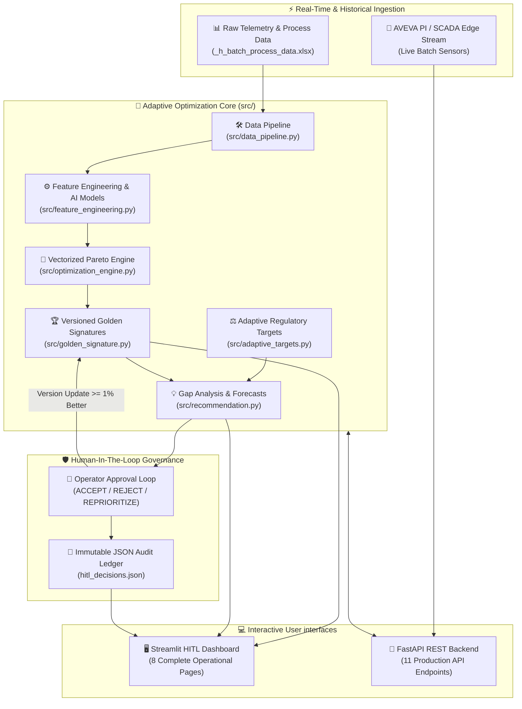
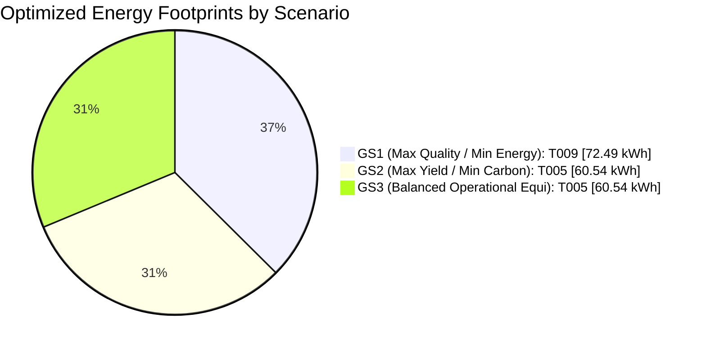

<div align="center">
  
# ⚡ AI-DRIVEN ADAPTIVE OPTIMIZATION ENGINE ⚡

[](https://git.io/typing-svg)

<p align="center">
  
  
  
  
  
  
</p>

<p align="center">
  <b>An autonomous, self-optimizing computational engine for pharmaceutical & industrial batch manufacturing.</b><br/>
  <i>Synthesizing artificial intelligence, physical thermodynamics, and human intuition to drive zero-waste manufacturing.</i>
</p>

<p align="center">
  <a href="https://adaptiveoptimizationengine-yw5jhs69m8ajrfwn53dzaw.streamlit.app/">
    
  </a>
  <a href="https://adaptive-optimization-engine-s81t.vercel.app/docs">
    
  </a>
</p>

<p align="center">
  <sub><i>Dashboard is hosted on Streamlit Community Cloud and sleeps after inactivity — first load may take ~60s to wake.</i></sub>
</p>

---
</div>

## 🌌 Executive Vision & Problem Space

Modern industrial batch manufacturing frequently suffers from **static parameter paralysis**: engineers execute identical control setpoints regardless of raw material variability or ambient anomalies. In pharmaceutical tablet manufacturing, this absence of a continuous feedback loop results in drastic efficiency variances—energy consumption swings wildly between **58.6 kWh** and **91.5 kWh per batch**, while Scope 1 & 2 carbon emissions remain entirely unquantified at the operational unit level.

### ✨ The VORTEX Solution
Our engine transforms legacy batch processes into an **adaptive, closed-loop cyber-physical system**:
1. **Continuous Machine Learning:** XGBoost regressors model real-time non-linear interactions across high-frequency manufacturing phases.
2. **Vectorized Multi-Objective Optimization:** Evaluates 5 competing objectives via instantaneous NumPy broadcasting tensor calculus.
3. **Dynamic Golden Signatures:** Establishes immutable, versioned baseline benchmarks for absolute operating efficiency.
4. **Human-In-The-Loop (HITL) Governance:** Intertwines operator domain expertise with AI parameter forecasts through an audit-compliant approval loop.

---

## 💎 Performance Telemetry & Key Impact

```
+---------------------------------------------------------------------------------------------------+
| 📊 CORE SYSTEM METRICS & ACHIEVEMENTS                                                            |
+----------------------------------------+----------------------------------------------------------+
| Total Production Batches Evaluated     | 60 High-Fidelity Historical Run Datasets                 |
| Engineered Process & Thermals Features | 34 (25 Telemetry + 7 Non-Linear Domain + 2 Derived)       |
| Vectorized Pareto Execution Time       | 4.74 milliseconds (Numpy Broadcasting Tensor Comparison) |
| Max Energy Savings Achieved          | 24.1% Reduction (58.6 kWh vs 79.8 kWh Fleet Average)     |
| Max Carbon Emissions Abated            | 24.1% Reduction (14.11 kg CO₂ vs 18.59 kg Fleet Avg)     |
| Quality Model R² (Cross-Validated)   | 0.9658 ± 0.009 (Target: Dissolution Rate)                |
| Energy Model R² (Cross-Validated)    | 0.9606 ± 0.016 (Target: Est. Total Energy kWh)           |
| High-Resolution T001 Phase Anomalies   | 8 Phase Anomaly Events Detected (Z-Score Threshold > 2.0)|
+----------------------------------------+----------------------------------------------------------+
```

---

## 🏗️ System Architecture & Data Topology



---

## 🚀 Quickstart & Ignition Guide

### Prerequisites
- **Python:** 3.11 or newer
- **OS:** Windows / macOS / Linux
- **RAM:** Minimal (<500MB runtime memory consumption)

### 1️⃣ Installation
```bash
# Clone or navigate to the workspace directory
cd AdaptiveOptimizationEngine

# Initialize lightweight Python Virtual Environment
python -m venv venv

# Activate Virtual Environment
# on Windows:
venv\Scripts\activate
# on Linux / macOS:
source venv/bin/activate

# Install full local dependency set (dashboard + API + model training)
pip install -r requirements-dev.txt
```

> **📦 On the three requirements files:** dependencies are split per deployment target so each
> platform installs only what it needs.
> - `requirements-dev.txt` — full local stack. **Use this one for local development.**
> - `requirements.txt` — slim API manifest read by Vercel's serverless builder (~130 MB).
> - `dashboard/requirements.txt` — Streamlit Cloud manifest, resolved next to `dashboard/app.py`.

### 2️⃣ Operational Entry Points
You can boot the system via three dedicated execution pipelines:

| Mode | Command | Target Interface | Purpose |
| :--- | :--- | :--- | :--- |
| 🖥️ **HITL UI** *(Recommended)* | `streamlit run dashboard/app.py` | [http://localhost:8501](http://localhost:8501) | Full interactive 8-page command center for engineers. |
| 🚀 **API Server** | `uvicorn api.main:app --reload --port 8000` | [http://localhost:8000/docs](http://localhost:8000/docs) | Enterprise REST integration & OpenAPI Swagger Docs. |
| ⚡ **Headless Batch** | `python src/optimization_engine.py` | Terminal Output | Execute headless recalculations of Pareto optimal fronts. |

---

## 🖥️ Command Center: 8-Page Dashboard Suite

The Streamlit UI provides deep visibility into operational state, thermodynamic telemetry, and predictive modeling:

<details open>
<summary><b>🔍 Click to explore Dashboard Modules</b></summary>

| Page Module | Core Functionality & Highlights |
| :--- | :--- |
| 🌟 **1. Overview** | Executive summary exhibiting 5 real-time KPIs, fleet energy distribution histograms, dissolution quality scatterplots, active Golden Signature metrics, and an interactive **Regulatory Carbon Pressure slider**. |
| 📊 **2. Data Explorer** | Deep exploratory analytics featuring multi-variable correlation heatmaps, dynamic parameter distributions, and exhaustive batch scorecard ledgers. |
| ⚡ **3. Optimization Engine** | 3D visual Pareto frontier mapping, side-by-side 3-scenario performance benchmarking, and automated composite scoring rankings. |
| 🏆 **4. Golden Signatures** | Detailed inspection of dominant operating signatures, thermodynamic parameter profiles, and historical version evolution tracking. |
| 🛡️ **5. HITL Workflow** | Interactive 8-parameter process control sliders, live AI outcome prediction widgets, automated parameter gap analysis against current GS, and operational decision switches (*ACCEPT / REJECT / REPRIORITIZE*). |
| 🧠 **6. Model Intelligence** | Cross-validated $R^2$ accuracy ledgers, XGBoost feature importance diagnostics, and live inference evaluation sandboxes. |
| 🔬 **7. T001 Time-Series Analysis** | Ultra-high resolution 211-point time-series telemetry inspection across 8 manufacturing phases, Z-score anomaly markers, machine vibration envelopes, and energy intensity phase breakdown. |
| 📜 **8. History & Learning** | Complete cryptographic-style audit trails of human decisions, Golden Signature version advancement charts, and fleet learning curves over time. |
</details>

---

## 🧠 Intelligence Engine & Domain Engineering

### 1️⃣ Machine Learning Models
The optimization core utilizes paired XGBoost regression models serialized in `data/processed/`, optimized via scikit-learn cross-validation arrays:

```
+------------------------------------------------------------------------------------------------+
| MODEL ARCHITECTURE & VALIDATION METRICS                                                        |
+----------------------+--------------------+--------------------+----------+--------------------+
| Target Model         | Algorithm          | R² Train Score     | R² CV    | Top Feature Weight |
+----------------------+--------------------+--------------------+----------+--------------------+
| Quality Prediction   | XGBoost Regressor  | 0.9938             | 0.9658   | Machine_Speed (32%)|
| Energy Prediction    | XGBoost Regressor  | 0.9996             | 0.9606   | Drying_Time (49%)  |
+----------------------+--------------------+--------------------+----------+--------------------+
```

### 2️⃣ Non-Linear Domain Features
To enable accurate AI modeling of complex thermodynamics and mechanical stresses, 7 specific domain efficiency ratios and physical indicators are synthesized:

$$\text{Efficiency Ratio} = \frac{\text{Quality Score} \times \text{Yield Score}}{\text{Est. Total Energy (kWh)}}$$

| Feature Name | Algebraic Mathematical Formulation | Physical Domain Purpose |
| :--- | :--- | :--- |
| `Energy_per_Quality` | $\frac{\text{Energy}}{\text{Quality\_Score}}$ | Specific energy cost per percentage point of dissolution quality. |
| `Efficiency_Ratio` | $\frac{\text{Quality} \times \text{Yield}}{\text{Energy}}$ | Overall throughput capability per unit kWh consumed. |
| `Carbon_per_Quality` | $\frac{\text{Carbon (kg)}}{\text{Quality\_Score}}$ | Environmental footprint per unit of finished efficacy. |
| `Drying_Intensity` | $\text{Drying\_Temp} \times \text{Drying\_Time}$ | Thermodynamic thermal exposure index during fluidization. |
| `Compression_Intensity`| $\text{Compression\_Force} \times \text{Machine\_Speed}$ | Total mechanical strain exerted during rotary tableting. |
| `Moisture_Deviation` | $|\text{Moisture} - 2.0|$ | Absolute Euclidean distance from theoretical ideal moisture content. |
| `Granulation_Efficiency`| $\frac{\text{Binder\_Amount}}{\text{Granulation\_Time}}$ | Chemical binding assimilation velocity during wet granulation. |

---

## 📐 Vectorized Pareto Multi-Objective Optimization

Traditional brute-force nested loops fail under real-time industrial constraints. Our optimization engine employs **NumPy Vectorized Broadcasting** to compute Pareto dominance across 5 competing dimensions simultaneously:
* **Maximize ($+$):** `Quality_Score`, `Yield_Score`, `Performance_Score`
* **Minimize ($-$):** `Est_Total_Energy_kWh`, `Est_Carbon_kg`

By transposing an $(N, 1, M)$ matrix against a $(1, N, M)$ tensor, dominance evaluations across all $N=60$ batches execute in **4.74 milliseconds**, effortlessly scaling to tens of thousands of real-time AVEVA PI datastream points.

### 🏆 Built-In Optimization Scenarios



---

## 🛡️ Human-in-the-Loop (HITL) Audit Governance

Autonomous automation in GMP (Good Manufacturing Practices) pharmaceutical facilities requires guaranteed safety interventions. Our engine enforces a rigid **Operator Approval Governance Cycle**:

```
        +-------------------------------------------------------------+
        |  Step 1: Operator Tweaks Sliders (8 Process Control Levers) |
        +------------------------------+------------------------------+
                                       |
                                       v
        +-------------------------------------------------------------+
        |  Step 2: AI Predicts Quality, Energy, & Emits Gap Forecasts |
        +------------------------------+------------------------------+
                                       |
        +------------------------------+------------------------------+
        |  Step 3: Human Operator Selects Strategic Governance Action  |
        +---------------+------------------------------+--------------+
                        |                              |
            +-----------+-----------+                  |
            |                       |                  |
            v                       v                  v
     [ ✔️ ACCEPT ]            [ ❌ REJECT ]       [ 🔄 REPRIORITIZE ]
            |                       |                  |
            v                       v                  v
  Evaluate Score Improvement   Log Rejection      Adjust Scenario
  >= 1.0% vs Active GS?        to Audit Log      Weights & Re-run
     |           |                               Pareto Algorithms
    Yes         No
     |           |
     v           v
 Increment    Retain
 GS Version  Current GS
     |           |
     +-----+-----+
           |
           v
+-------------------------------------------------------------+
|  Step 4: Cryptographic Commit to Immutable Audit JSON Log   |
+-------------------------------------------------------------+
```

---

## 🌍 Adaptive Targets & Regulatory Empathy

As global environmental compliance standards tighten, manufacturing operations must react dynamically. The engine incorporates an interactive **Regulatory Pressure Coefficient ($\lambda$)** ranging from `0.0` (Relaxed) to `1.0` (Stringent).

```
Energy Target (kWh)  = Fleet_Average_Energy * (1 - (0.08 * (1 + (Pressure - 0.5))))
Carbon Target (kg)   = Fleet_Average_Carbon * (1 - (0.10 * (1 + (Pressure - 0.5))))
```

| Pressure Profile ($\lambda$) | Regulatory Mode | Target Max Energy (kWh) | Target Max Carbon (kg CO₂) | Operational Mandate |
| :---: | :---: | :---: | :---: | :--- |
| **0.00** | 🟢 **Relaxed** | `79.8 kWh` | `18.59 kg` | Standard operating tolerance; prioritize maximum throughput. |
| **0.50** | 🟡 **Moderate** | `76.6 kWh` | `17.66 kg` | Balanced sustainable operation; default baseline optimization target. |
| **1.00** | 🔴 **Stringent** | `73.4 kWh` | `16.73 kg` | Aggressive decarbonization; throttle mechanical intensity. |

---

## 🔌 Enterprise REST API Suite (FastAPI)

The headless backend exposes an OpenAPI-compliant REST surface designed for direct integration with **AVEVA PI Data Archive**, **MES Enterprise systems**, and industrial SCADA controllers:

```bash
# Live production API — returns all 3 optimization scenarios (try it now)
curl -X 'GET' 'https://adaptive-optimization-engine-s81t.vercel.app/optimize/all' \
  -H 'accept: application/json'

# Local equivalent, once the server is running
curl -X 'POST' 'http://localhost:8000/optimize?scenario=balanced' \
  -H 'accept: application/json' -d ''
```

| HTTP Method | API Endpoint Route | Payload Description & Returns |
| :---: | :--- | :--- |
| `GET` | `/` & `/health` | Lightweight service diagnostic ping and pipeline availability confirmation. |
| `POST` | `/optimize` | Computes optimal operational parameter arrays for a selected scenario. |
| `GET` | `/optimize/all` | Simultaneous evaluation and transmission of all 3 optimization scenarios. |
| `GET` | `/golden-signature` | Retrieve full telemetry ledgers for active Golden Signature versions. |
| `GET` | `/golden-signature/{key}`| Granular parameter pull for a specific target signature (e.g., `GS1_QUALITY_ENERGY`). |
| `POST` | `/hitl-decision` | Ingest operator governance choices (`ACCEPT` / `REJECT` / `REPRIORITIZE`) and append to log. |
| `GET` | `/hitl-history` | Fetch complete timestamped operational audit history for GMP compliance auditing. |
| `POST` | `/recommend` | Calculate parameter Delta recommendations based on real-time sensor array payload. |
| `GET` | `/adaptive-targets`| Return active energy and Scope 2 emission ceiling targets under prevailing pressure. |
| `GET` | `/history` | Full batch ledger — all 60 processed batches with quality, yield, performance, energy, and carbon scores. |

---

## 🔮 Enterprise Edge & SCADA Scalability

- **AVEVA Native Integration:** Designed to plug directly into AVEVA PI Asset Frameworks. The REST endpoints natively accept streaming time-series buffers from rotary tableters and fluid bed granulators.
- **Zero-Database Dependency Edge Architecture:** By persisting versioned state across ultra-fast atomic JSON serialization structures (`golden_signatures.json`, `hitl_decisions.json`) and compressed serialized XGBoost memory weights (`.pkl`), the entire system can deploy on air-gapped **Industrial Edge Computers** without external database overhead.
  *Note: on the hosted serverless demo the audit ledger is effectively read-only and resets on each deployment — persistent writes require an edge or containerized target.*
- **Single-Source of Truth Setup (`config.py`):** Every thermodynamic calibration scalar, electrical grid carbon emission factor ($0.000233 \text{ kg CO}_2/\text{Wh}$ for India Grid), and update threshold is decoupled in a single declarative python module. Adapting the system from pharmaceutical tablets to chemical reactors, food manufacturing, or energy grid load optimization requires updating *zero lines of core engine code*.

---

<div align="center">

### 🏆 Proudly Engineered by Team VORTEX 🏆
**National AI & ML Hackathon — YUVAAN**  
*Organized by Tinkerers' Lab, IIT Hyderabad & Powered by AVEVA*

[](LICENSE)
[](https://www.aveva.com/)
[](https://iith.ac.in/)

```
⚡ Built with precision. Optimized for impact. Driving zero-waste manufacturing. ⚡
```

</div>